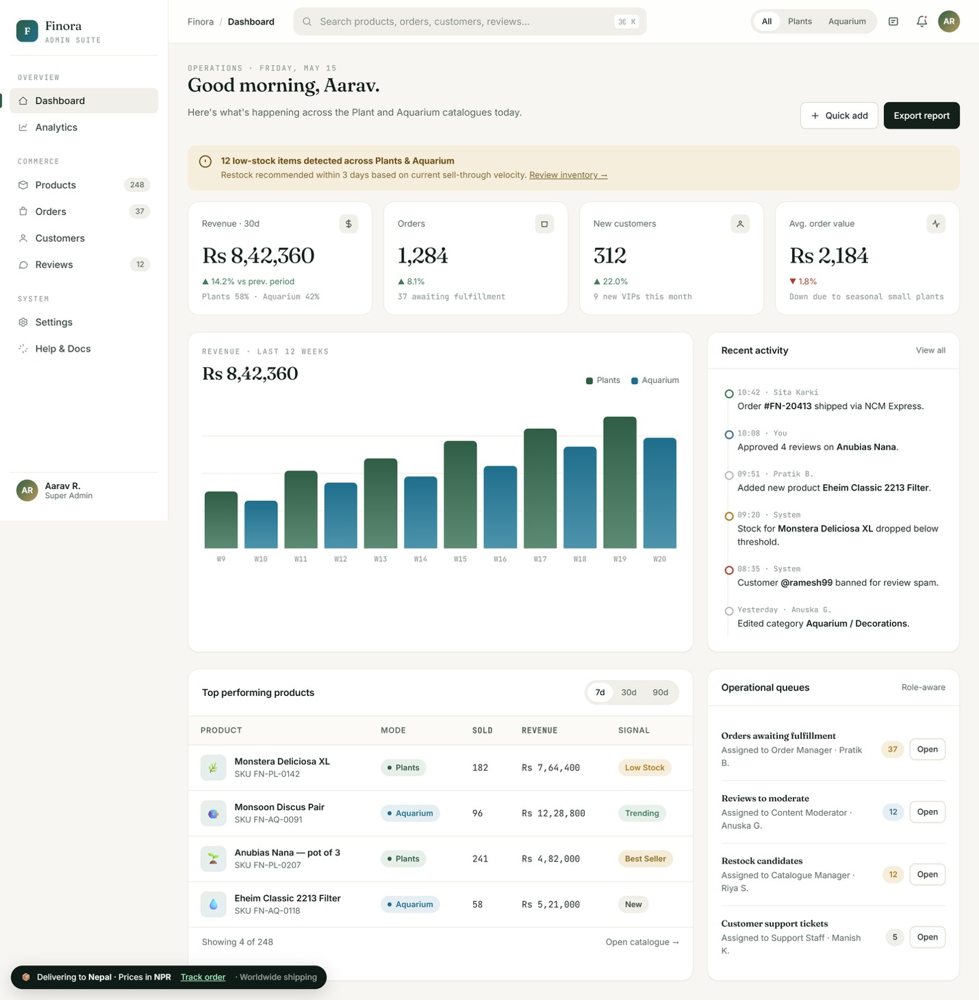

<h1 align="center">🌿 Finora</h1>

<p align="center">
A modern full-stack e-commerce platform specializing in <strong>Plants</strong> and <strong>Aquarium Products</strong>, featuring secure authentication, an intuitive shopping experience, and a comprehensive admin management system.
</p>

<p align="center">


</p>

---

# 📖 About the Project

**Finora** is a premium full-stack e-commerce web application developed to provide a seamless online shopping experience for **plant enthusiasts** and **aquarium hobbyists**.

The platform offers customers an elegant interface for browsing products, managing shopping carts, placing orders, and securely interacting with the system. Alongside the customer-facing experience, Finora includes a powerful administrative dashboard that allows administrators to efficiently manage products, categories, inventory, and overall store operations.

The project emphasizes responsive design, clean user interfaces, secure authentication, and scalable application architecture while demonstrating the practical implementation of Java web technologies.

---

# ✨ Features

## 👤 Customer

- 🌱 Browse Plant Products
- 🐠 Browse Aquarium Products
- 🔍 Product Search
- 🛒 Shopping Cart
- ❤️ Wishlist
- 👤 User Registration & Login
- 📦 Order Placement
- 📱 Responsive Design

---

## 🛠 Admin

- Dashboard
- Product Management
- Inventory Management
- Category Management
- User Management
- Order Management
- CRUD Operations
- Store Administration

---

# 🛠 Built With

### Frontend

- HTML5
- CSS3
- JavaScript
- JSP

### Backend

- Java
- Servlets
- JDBC

### Database

- MySQL

### Tools

- Eclipse IDE
- Apache Tomcat
- Git
- GitHub

---

# 📷 Application Preview

## ⚙️ Admin Dashboard

<p align="center">

</p>

---

# 🏗 Project Architecture

```
Finora/
│
├── src/
├── WebContent/
│
├── assets/
│
├── database/
│
├── Finora...pdf
│
└── README.md
```

---

# 🧠 Key Concepts Demonstrated

- MVC Architecture
- Java Servlets
- JSP
- JDBC
- CRUD Operations
- Session Management
- Authentication
- Responsive UI
- Database Design
- E-Commerce Workflow

---

# 🚀 Getting Started

## Clone Repository

```bash
git clone https://github.com/Dibyant4/Finora.git
```

---

## Requirements

- Java JDK 17+
- Apache Tomcat
- MySQL
- Eclipse IDE

---

## Setup

1. Clone the repository.
2. Import the project into Eclipse.
3. Configure Apache Tomcat.
4. Create the MySQL database.
5. Update database credentials.
6. Run the project on Tomcat.
7. Open the application in your browser.

---

# 📈 Future Improvements

- Online Payment Gateway
- Product Reviews
- Recommendation System
- Order Tracking
- Email Notifications
- Admin Analytics Dashboard
- Dark Mode
- AI Product Recommendations

---

# 📄 Documentation

Project documentation is included in:

```
Finora...pdf
```

---

# 👨‍💻 Author

<div align="center">

### Dibyant Bhatta

*Building software that matters, designing experiences people enjoy.*

**Software Developer • Full Stack Developer • UI/UX Designer • IoT Enthusiast**


</p>

⭐ If you enjoyed exploring this project, consider giving it a star!

</div>
